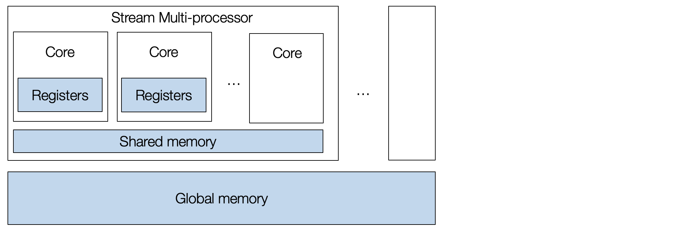
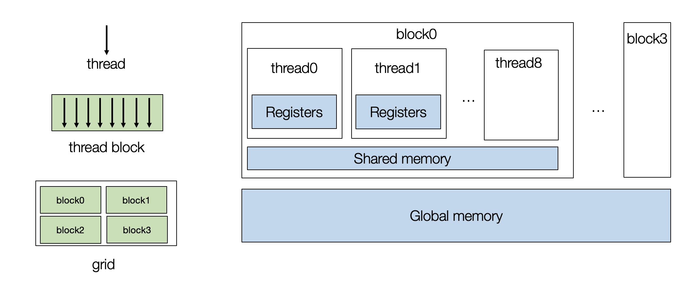
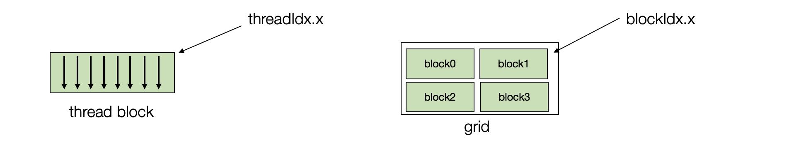
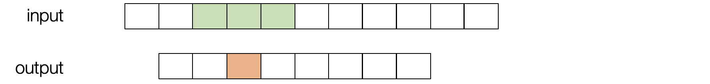
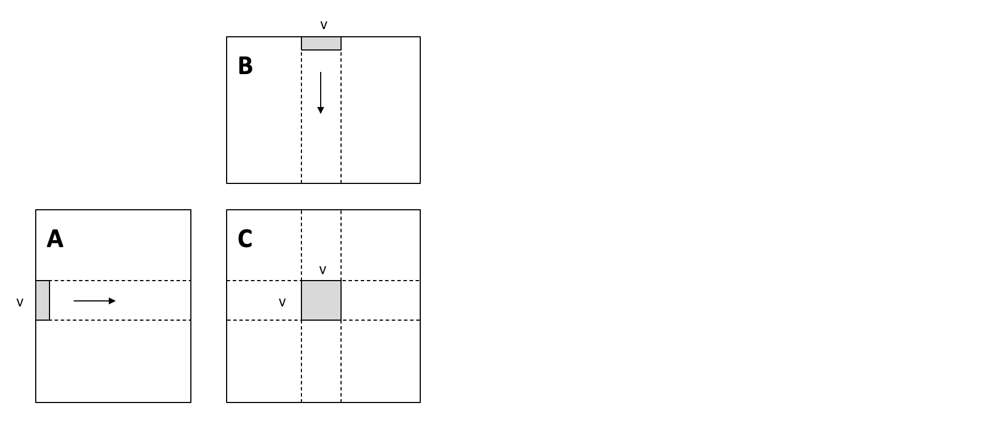
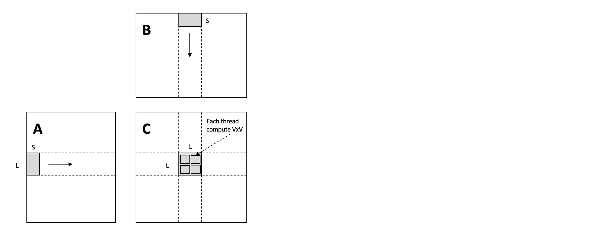

## Part 1

In the past chapter, we discussed  MLC flows in CPU environments. This chapter will discuss how to bring some of the optimizations onto GPU. We are going to use CUDA terminology. However, the same set of concepts applies to other kinds of GPUs as well.

### Install packages

For this course, we will use some ongoing development in TVM, which is an open-source machine learning compilation framework. We provide the following command to install a packaged version for MLC course. The particular notebook of **part 1** depends on a CUDA 11 environment.

```bash
python3 -m pip install mlc-ai-nightly-cu110 -f https://mlc.ai/wheels
```

**NOTE: Our build system does not have GPU support yet, so part of codes will not be evaluated.**

### Preparations

To begin with, let us import the necessary dependencies.

```{.python .input}
import tvm
from tvm.ir.module import IRModule
from tvm.script import tir as T, relax as R
from tvm import relax
import numpy as np
```

### GPU Architecture

Let us begin by reviewing what a GPU architecture looks like. A typical GPU contains a collection of stream multi-processors, and each multi-processor has many cores. A GPU device is massively parallel and allows us to execute many tasks concurrently.



To program a GPU, we need to create a set of thread blocks, with each thread mapping to the cores and the thread block map to the stream multiprocessors.



Let us start GPU programming using a vector add example. The following TensorIR program takes two vectors, A and B, performs element-wise add, and stores the result in C.

```{.python .input}
@tvm.script.ir_module
class MyModuleVecAdd:
    @T.prim_func
    def main(A: T.Buffer((1024,), "float32"),
             B: T.Buffer((1024,), "float32"),
             C: T.Buffer((1024,), "float32")) -> None:
        T.func_attr({"global_symbol": "main", "tir.noalias": True})
        for i in T.grid(1024):
            with T.block("C"):
                vi = T.axis.remap("S", [i])
                C[vi] = A[vi] + B[vi]
```

We first split loop `i` into two loops.

```{.python .input}
sch = tvm.tir.Schedule(MyModuleVecAdd)
block_C = sch.get_block("C")
i, = sch.get_loops(block=block_C)
i0, i1 = sch.split(i, [None, 128])
sch.mod.show()
```

#### GPU Thread Blocks

Then we bind the iterators to the GPU thread blocks. Each thread is parameterized by two indices -- `threadIdx.x` and `blockIdx.x`. In practice, we can have multiple dimensional thread indices, but we keep them simple as one dimension.



```{.python .input}
sch.bind(i0, "blockIdx.x")
sch.bind(i1, "threadIdx.x")
sch.mod.show()
```

#### Build and Run the TensorIR Function on GPU

We can build and test out the resulting function on the GPU.

```python
rt_mod = tvm.build(sch.mod, target="cuda")

A_np = np.random.uniform(size=(1024,)).astype("float32")
B_np = np.random.uniform(size=(1024,)).astype("float32")
A_nd = tvm.nd.array(A_np, tvm.cuda(0))
B_nd = tvm.nd.array(B_np, tvm.cuda(0))
C_nd = tvm.nd.array(np.zeros((1024,), dtype="float32"), tvm.cuda(0))

rt_mod["main"](A_nd, B_nd, C_nd)
print(A_nd)
print(B_nd)
print(C_nd)
```

### Window Sum Example

Now, let us move forward to another example -- window sum. This program can be viewed as a basic version of "convolution" with a predefined weight `[1,1,1]`. We are taking sliding over the input and add three neighboring values together.



```{.python .input}
@tvm.script.ir_module
class MyModuleWindowSum:
    @T.prim_func
    def main(A: T.Buffer[(1027,), "float32"],
             B: T.Buffer[(1024,), "float32"]) -> None:
        T.func_attr({"global_symbol": "main", "tir.noalias": True})
        for i in T.grid(1024):
            with T.block("C"):
                vi = T.axis.remap("S", [i])
                B[vi] = A[vi] + A[vi + 1] + A[vi + 2]
```

First, we can bind the loop to GPU threads.

```{.python .input}
sch = tvm.tir.Schedule(MyModuleWindowSum)
nthread = 128
block_C = sch.get_block("C")
i,  = sch.get_loops(block=block_C)
i0, i1 = sch.split(i, [None, nthread])
sch.bind(i0, "blockIdx.x")
sch.bind(i1, "threadIdx.x")
sch.mod.show()
```


Importantly, in this case, there are reuse opportunities. Remember that each GPU thread block contains shared memory that all threads can access within the block. We use `cache_read` to add an intermediate stage that caches segments (in green below) onto the shared memory. After the caching is finished, the threads can then read from the shared memory.

```{.python .input}
A_shared = sch.cache_read(block_C, read_buffer_index=0, storage_scope="shared")
sch.compute_at(A_shared, i1)
sch.mod.show()
```

Because the memory is shared across threads, we need to re-split the loop and bind the inner iterator of the fetching process onto the thread indices. This technique is called **cooperative fetching**, where multiple threads work together to bring the data onto the shared memory. The following reading process can be different.

```{.python .input}
ax = sch.get_loops(A_shared)[-1]
ax0, ax1 = sch.split(ax, [None, nthread])
sch.bind(ax1, "threadIdx.x")
sch.mod.show()
```

We can inspect the corresponding low-level code (in CUDA). The generated code contains two parts:

- A host part that calls into the GPU driver
- A cuda kernel that runs the corresponding computation.

We can print out the cuda kernel using the following code. We still need both the host and kernel code to run the program, so it is only a quick way to inspect what the final code generation result.

Notably, the build process automatically compacts the shared memory stage to use a minimum region used within the thread block.

```python
rt_mod = tvm.build(sch.mod, target="cuda")
print(rt_mod.imported_modules[0].get_source())
```

#### Build Code for Other GPU Platforms

A MLC process usually support targeting multiple kinds of hardware platforms, we can generate Metal code(which is another kind of GPU programming model) by changing the target parameter.

```python
rt_mod = tvm.build(sch.mod, target="metal")
print(rt_mod.imported_modules[0].get_source())
```

### Matrix Multiplication

Let us now get to something slightly more complicated and try out optimizing matrix multiplication on GPU. We will go over two common techniques for GPU performance optimization.

```{.python .input}
@tvm.script.ir_module
class MyModuleMatmul:
    @T.prim_func
    def main(A: T.Buffer((1024, 1024), "float32"),
             B: T.Buffer((1024, 1024), "float32"),
             C: T.Buffer((1024, 1024), "float32")) -> None:
        T.func_attr({"global_symbol": "main", "tir.noalias": True})
        for i, j, k in T.grid(1024, 1024, 1024):
            with T.block("C"):
                vi, vj, vk = T.axis.remap("SSR", [i, j, k])
                with T.init():
                    C[vi, vj] = 0.0
                C[vi, vj] = C[vi, vj] + A[vi, vk] * B[vk, vj]
```

#### Local Blocking



To increase overall memory reuse. We can tile the loops. In particular, we introduce local tiles such that we only need to load stripe of data from A and B once, then use them to perform a `V * V` matrix multiplication result.

This local tiling helps to reduce the memory pressure, as each element in the stripe is reused `V` times.

```{.python .input}
def blocking(sch,
             tile_local_y,
             tile_local_x,
             tile_block_y,
             tile_block_x,
             tile_k):
    block_C = sch.get_block("C")
    C_local = sch.cache_write(block_C, 0, "local")

    i, j, k = sch.get_loops(block=block_C)

    i0, i1, i2 = sch.split(loop=i, factors=[None, tile_block_y, tile_local_y])
    j0, j1, j2 = sch.split(loop=j, factors=[None, tile_block_x, tile_local_x])
    k0, k1 = sch.split(loop=k, factors=[None, tile_k])
    sch.unroll(k1)
    sch.reorder(i0, j0, i1, j1, k0, k1, i2, j2)
    sch.reverse_compute_at(C_local, j1)

    sch.bind(i0, "blockIdx.y")
    sch.bind(j0, "blockIdx.x")

    sch.bind(i1, "threadIdx.y")
    sch.bind(j1, "threadIdx.x")
    sch.decompose_reduction(block_C, k0)

    return sch

sch = tvm.tir.Schedule(MyModuleMatmul)
sch = blocking(sch, 8, 8, 8, 8, 4)
sch.mod.show()
```

```python
rt_mod = tvm.build(sch.mod, target="cuda")
dev = tvm.cuda(0)
A_np = np.random.uniform(size=(1024, 1024)).astype("float32")
B_np = np.random.uniform(size=(1024, 1024)).astype("float32")
A_nd = tvm.nd.array(A_np, dev)
B_nd = tvm.nd.array(B_np, dev)
C_nd = tvm.nd.array(np.zeros((1024, 1024), dtype="float32"), dev)

num_flop = 2 * 1024 * 1024 * 1024
evaluator = rt_mod.time_evaluator("main", dev, number=10)

print("GEMM-Blocking: %f GFLOPS" % (num_flop / evaluator(A_nd, B_nd, C_nd).mean / 1e9))
```

### Shared Memory Blocking



Our first attempt did not consider the neighboring threads which sit in the same GPU thread block, and we can load the data they commonly need into a piece of shared memory.

The following transformation does that.

```{.python .input}
def cache_read_and_coop_fetch(sch, block, nthread, read_idx, read_loc):
    read_cache = sch.cache_read(block=block, read_buffer_index=read_idx, storage_scope="shared")
    sch.compute_at(block=read_cache, loop=read_loc)
    # vectorized cooperative fetch
    inner0, inner1 = sch.get_loops(block=read_cache)[-2:]
    inner = sch.fuse(inner0, inner1)
    _, tx, vec = sch.split(loop=inner, factors=[None, nthread, 4])
    sch.vectorize(vec)
    sch.bind(tx, "threadIdx.x")


def blocking_with_shared(
    sch,
    tile_local_y,
    tile_local_x,
    tile_block_y,
    tile_block_x,
    tile_k):
    block_C = sch.get_block("C")
    C_local = sch.cache_write(block_C, 0, "local")

    i, j, k = sch.get_loops(block=block_C)

    i0, i1, i2 = sch.split(loop=i, factors=[None, tile_block_y, tile_local_y])
    j0, j1, j2 = sch.split(loop=j, factors=[None, tile_block_x, tile_local_x])
    k0, k1 = sch.split(loop=k, factors=[None, tile_k])

    sch.reorder(i0, j0, i1, j1, k0, k1, i2, j2)
    sch.reverse_compute_at(C_local, j1)

    sch.bind(i0, "blockIdx.y")
    sch.bind(j0, "blockIdx.x")

    tx = sch.fuse(i1, j1)
    sch.bind(tx, "threadIdx.x")
    nthread = tile_block_y * tile_block_x
    cache_read_and_coop_fetch(sch, block_C, nthread, 0, k0)
    cache_read_and_coop_fetch(sch, block_C, nthread, 1, k0)
    sch.decompose_reduction(block_C, k0)

    return sch

sch = tvm.tir.Schedule(MyModuleMatmul)
sch = blocking_with_shared(sch, 8, 8, 8, 8, 8)
sch.mod.show()
```

```python
rt_mod = tvm.build(sch.mod, target="cuda")
dev = tvm.cuda(0)
evaluator = rt_mod.time_evaluator("main", dev, number=10)

print("GEMM-Blocking: %f GFLOPS" % (num_flop / evaluator(A_nd, B_nd, C_nd).mean / 1e9))
```

### Leveraging Automatic Program Optimization

So far, we have been manually writing transformations to optimize the TensorIR program on GPU. We can leverage the automatic program optimization framework to tune the same program. The following code does that, we only set a small number here, and it can take a few min to finish.

```python
from tvm import meta_schedule as ms

database = ms.tune_tir(
    mod=MyModuleMatmul,
    target="nvidia/tesla-p100",
    max_trials_global=64,
    num_trials_per_iter=64,
    work_dir="./tune_tmp",
)
sch = ms.tir_integration.compile_tir(database, MyModuleMatmul, "nvidia/tesla-p100")
sch.mod.show()
```

```python
rt_mod = tvm.build(sch.mod, target="nvidia/tesla-p100")
dev = tvm.cuda(0)
evaluator = rt_mod.time_evaluator("main", dev, number=10)

print("MetaSchedule: %f GFLOPS" % (num_flop / evaluator(A_nd, B_nd, C_nd).mean / 1e9))
```

### Summary

This chapter studies another axis of MLC -- how we can transform our program for hardware acceleration. The MLC process helps us to bridge the input models toward different GPU programming models and environments. We will visit more hardware specialization topics in the incoming chapter as well.

- A typical GPU contains two-level hierarchy. Each thread is indexed by(in cuda terminology) `threadIdx.x` and `blockIdx.x`(there can be multiple dimension indices as well, but they can be fused to one.
- Shared memory helps cache data commonly used across the threads within the same block.
- Encourage memory reuse during GPU optimization.
    