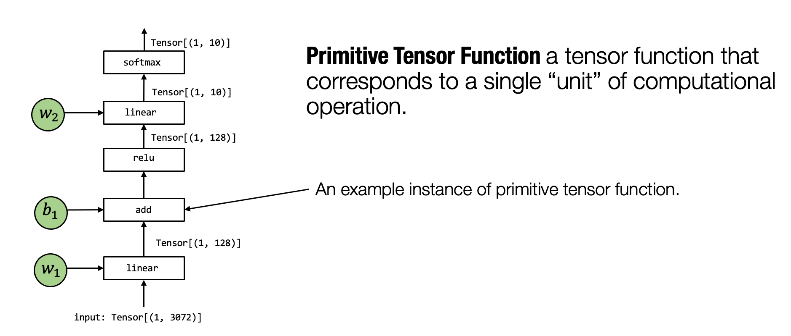
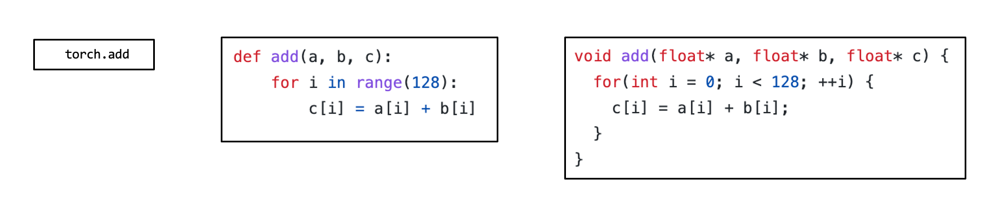
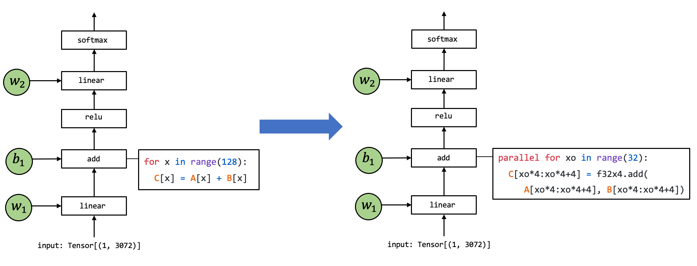
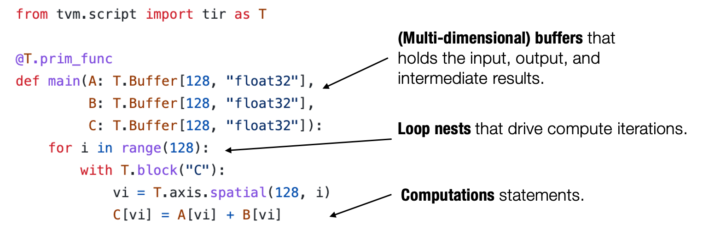
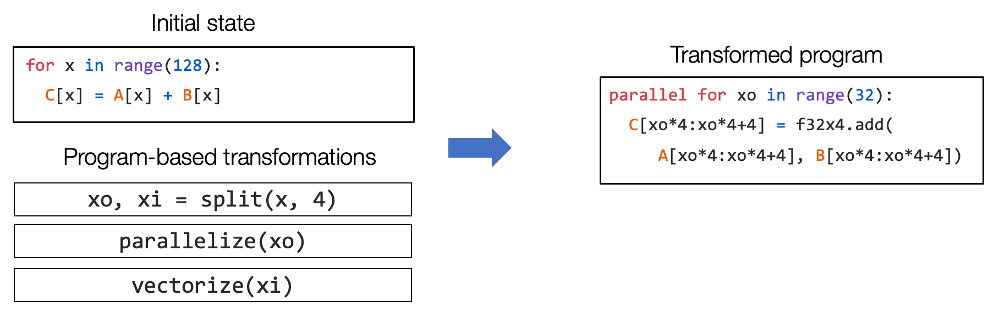
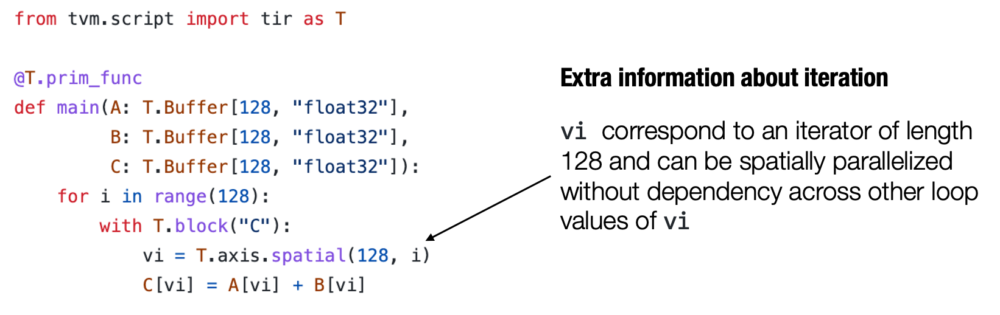

# Tensor Program Abstraction

:label:`chap_tensor_program`

In this chapter, we will discuss the abstractions for a single “unit” step of computation and possible MLC transformations in these abstractions.

## Primitive Tensor Function

The introductory overview showed that the MLC process could be viewed as transformations among tensor functions. A typical model execution involves several computation steps that transform tensors from input to the final prediction, and each unit step is called a primitive tensor function.


:label:`fig_primitive_tensor_func`

In the above figure, the tensor operator linear, add, relu, and softmax are all primitive tensor functions. Notably, many different abstractions can represent (and implement) the same primitive tensor function add (as shown in the figure below). We can choose to call into pre-built framework libraries(e.g. torch.add or numpy.add), and leverage an implementation in python. In practice, primitive functions are implemented in low-level languages such as C/C++ with sometimes a mixture of assembly code.


:label:`fig_tensor_func_abstractions`

Many frameworks offer machine learning compilation procedures to transform primitive tensor functions into more specialized ones for the particular workload and deployment environment.


:label:`fig_tensor_func_transformation`

The above figure shows an example where the implementation of the primitive tensor function add gets transformed into a different implementation. The particular code on the right is a pseudo-code representing possible set optimizations: the loop gets split into units of length `4` where `f32x4` add corresponds to a special vector add function that carries out the computation.

## Tensor Program Abstraction

The last section talks about the need to transform primitive tensor functions. In order for us to effectively do so, we need an effective abstraction to represent the programs.

Usually, a typical abstraction for primitive tensor function implementation contains the following elements: multi-dimensional buffers, loop nests that drive the tensor computations, and finally, the compute statements themselves.


:label:`fig_tensor_func_elements`

We call this type of abstraction tensor program abstraction. One important property of tensor program abstraction is the ability to change the program through a sequence of transformations pragmatically.


:label:`fig_tensor_func_seq_transform`

For example, we should be able to use a set of transformation primitives(split, parallelize, vectorize) to take the initial loop program and transform it into the program on the right-hand side.

### Extra Structure in Tensor Program Abstraction

Importantly, we cannot perform arbitrary transformations on the program as some computations depend on the order of the loop. Luckily, most primitive tensor functions we are interested in have good properties (such as independence among loop iterations).

Tensor programs can incorporate this extra information as part of the program to facilitate program transformations.


:label:`fig_tensor_func_iteration`

For example, the above program contains the additional `T.axis.spatial` annotation, which shows that the particular variable `vi` is mapped to `i`, and all the iterations are independent. This information is not necessary to execute the particular program but comes in handy when we transform the program. In this case, we will know that we can safely parallelize or reorder loops related to `vi` as long as we visit all the index elements from `0` to `128`.

## Tensor Program Transformation in Action

### Install Packages

For the purpose of this course, we will use some on-going development in tvm, which is an open source machine learning compilation framework. We provide the following command to install a packaged version for mlc course.

```bash
python3 -m  pip install mlc-ai-nightly -f https://mlc.ai/wheels
```

### Constructing Tensor Program

Let us begin by constructing a tensor program that performs addition among two vectors.

```{.python .input n=0}
import tvm
from tvm.ir.module import IRModule
from tvm.script import tir as T
import numpy as np
```

```{.python .input n=1}
@tvm.script.ir_module
class MyModule:
    @T.prim_func
    def main(A: T.Buffer[128, "float32"],
             B: T.Buffer[128, "float32"],
             C: T.Buffer[128, "float32"]):
        # extra annotations for the function
        T.func_attr({"global_symbol": "main", "tir.noalias": True})
        for i in range(128):
            with T.block("C"):
                # declare a data parallel iterator on spatial domain
                vi = T.axis.spatial(128, i)
                C[vi] = A[vi] + B[vi]
```

TVMScript is a way for us to express tensor program in python ast. Note that this code do not actually correspond to a python program, but a tensor program that can be used in MLC process. The language is designed to align with python syntax with additional structures to facilitate analysis and transformation.

```{.python .input n=2}
type(MyModule)
```

MyModule is an instance of an IRModule data structure, which is used to hold a collection of tensor functions.

We can use the script function get a string based representation of the IRModule. This function is quite useful for inspecting the module during each step of transformation.

```{.python .input n=3}
print(MyModule.script())
```

### Build and run
Any any time point, we can turn an IRModule to runnable functions by calling a build function.

```{.python .input n=4}
rt_mod = tvm.build(MyModule, target="llvm")  # The module for CPU backends.
type(rt_mod)
```

After build, mod contains a collection of runnable functions. We can retrieve each function by its name.

```{.python .input n=5}
func = rt_mod["main"]
func
```

```{.python .input n=6}
a = tvm.nd.array(np.arange(128, dtype="float32"))
b = tvm.nd.array(np.ones(128, dtype="float32"))
c = tvm.nd.empty((128,), dtype="float32")
```

To invoke the function, we can create three NDArrays in the tvm runtime, and then invoke the generated function.

```{.python .input n=7}
func(a, b, c)
```

```{.python .input n=8}
print(a)
```
```{.python .input n=9}
print(b)
```
```{.python .input n=10}
print(c)
```

### Transform the Tensor Program

Now let us start to transform the Tensor Program. A tensor program can be transformed using an auxiliary data structure called schedule.

```{.python .input n=11}
sch = tvm.tir.Schedule(MyModule)
type(sch)
```

Let us first try to split the loops

```{.python .input n=12}
# Get block by its name
block_c = sch.get_block("C")
# Get loops surrounding the block
(i,) = sch.get_loops(block_c)
# Tile the loop nesting.
i_0, i_1, i_2 = sch.split(i, factors=[None, 4, 4])
print(sch.mod.script())
```

We can also reorder the loops. Now we move loop i_2 to outside of i_1.

```{.python .input n=13}
sch.reorder(i_0, i_2, i_1)
print(sch.mod.script())
```

Finally, we can add hints to the program generator that we want to parallel the outer-most loop.

```{.python .input n=14}
sch.parallel(i_0)
print(sch.mod.script())
```

We can build and run the transformed program

```{.python .input n=15}
transformed_mod = tvm.build(sch.mod, target="llvm")  # The module for CPU backends.
transformed_mod["main"](a, b, c)
print(c)
```

### Constructing Tensor Program using Tensor Expression

In the previous example, we directly use TVMScript to construct the tensor program. In practice, it is usually helpful to construct these functions pragmatically from existing definitions. Tensor expression is an API that helps us to build some of the expression-like array computations.

```{.python .input n=16}
# namespace for tensor expression utility
from tvm import te

# declare the computation using the expression API
A = te.placeholder((128, ), name="A")
B = te.placeholder((128, ), name="B")
C = te.compute((128,), lambda i: A[i] + B[i], name="C")

# create a function with the specified list of arguments.
func = te.create_prim_func([A, B, C])
# mark that the function name is main
func = func.with_attr("global_symbol", "main")
ir_mod_from_te = IRModule({"main": func})

print(ir_mod_from_te.script())
```

### Transforming a matrix multiplication program

In the above example, we showed how to transform an vector add. Now let us try to apply that to a slightly more complicated program(matrix multiplication). Let us first try to build the initial code using the tensor expression API.

```{.python .input n=17}
from tvm import te

M = 1024
K = 1024
N = 1024

# The default tensor type in tvm
dtype = "float32"

target = "llvm"
dev = tvm.device(target, 0)

# Algorithm
k = te.reduce_axis((0, K), "k")
A = te.placeholder((M, K), name="A")
B = te.placeholder((K, N), name="B")
C = te.compute((M, N), lambda m, n: te.sum(A[m, k] * B[k, n], axis=k), name="C")

# Default schedule
func = te.create_prim_func([A, B, C])
func = func.with_attr("global_symbol", "main")
ir_module = IRModule({"main": func})
print(ir_module.script())


func = tvm.build(ir_module, target="llvm")  # The module for CPU backends.

a = tvm.nd.array(np.random.rand(M, K).astype(dtype), dev)
b = tvm.nd.array(np.random.rand(K, N).astype(dtype), dev)
c = tvm.nd.array(np.zeros((M, N), dtype=dtype), dev)
func(a, b, c)

evaluator = func.time_evaluator(func.entry_name, dev, number=1)
print("Baseline: %f" % evaluator(a, b, c).mean)
```

We can transform the loop access pattern to make it more cache friendly. Let us use the following schedule.

```{.python .input n=18}
sch = tvm.tir.Schedule(ir_module)
type(sch)
block_c = sch.get_block("C")
# Get loops surrounding the block
(y, x, k) = sch.get_loops(block_c)
block_size = 32
yo, yi = sch.split(y, [None, block_size])
xo, xi = sch.split(x, [None, block_size])

sch.reorder(yo, xo, k, yi, xi)
print(sch.mod.script())

func = tvm.build(sch.mod, target="llvm")  # The module for CPU backends.

c = tvm.nd.array(np.zeros((M, N), dtype=dtype), dev)
func(a, b, c)

evaluator = func.time_evaluator(func.entry_name, dev, number=1)
print("after transformation: %f" % evaluator(a, b, c).mean)
```

Try to change the value of bn to see what performance you can get. In practice, we will leverage an automated system to search over a set of possible transformations to find an optimal one.

## Summary

- Primitive tensor function refers to the single unit of computation in model execution.

  - A MLC process can choose to transform implementation of primitive tensor functions.
- Tensor program is an effective abstraction to represent primitive tensor functions.
  - Key elements include: multi-dimensional buffer, loop nests, computation statement.
  - Program-based transformations can be used to optimize tensor programs.
  - Extra structure can help to provide more information to the transformations.
